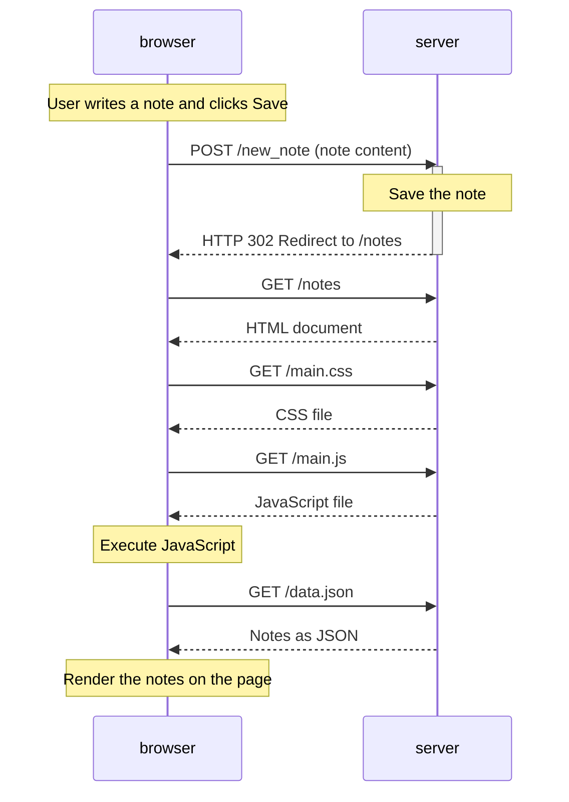

# 0.4: New note

```mermaid
sequenceDiagram
    participant browser
    participant server

    Note over browser: User writes a note and clicks Save
    browser->>server: POST /new_note (note content)
    activate server
    Note over server: Save the note
    server-->>browser: HTTP 302 Redirect to /notes
    deactivate server

    browser->>server: GET /notes
    server-->>browser: HTML document

    browser->>server: GET /main.css
    server-->>browser: CSS file

    browser->>server: GET /main.js
    server-->>browser: JavaScript file

    Note over browser: Execute JavaScript

    browser->>server: GET /data.json
    server-->>browser: Notes as JSON

    Note over browser: Render the notes on the page
```